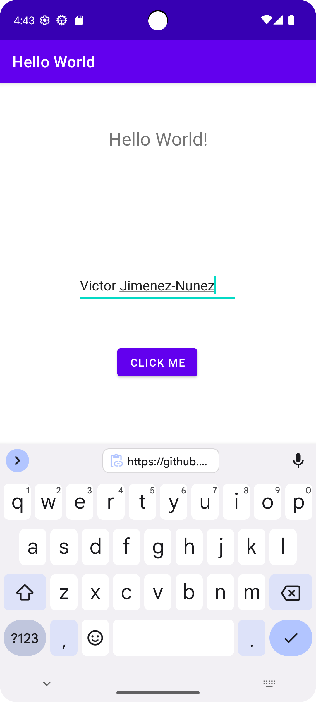
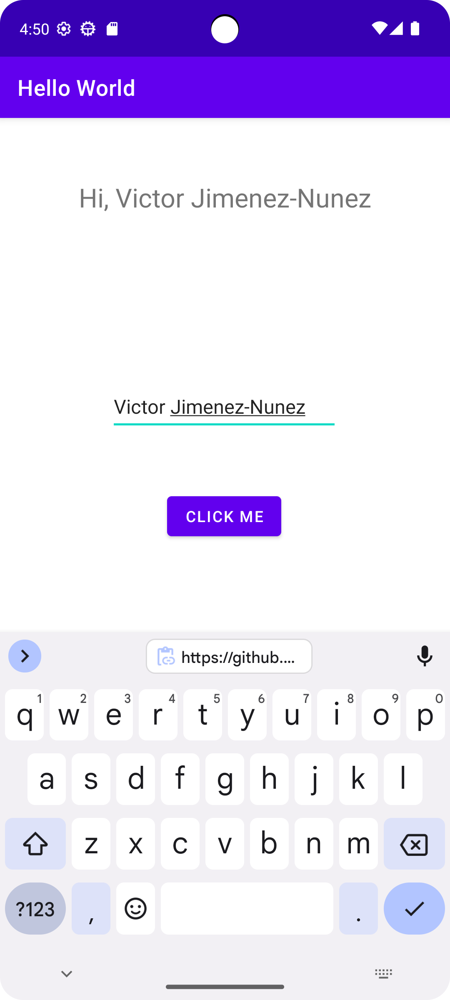

# Hello World App

## How It Works

This is a simple "Hello World" app that demonstrates basic android Views. It showcases:

1. Centered Hello World message
2. A 'Click me' button
3. An input field for your name
4. A greeting when it's clicked (Hi, {name})

